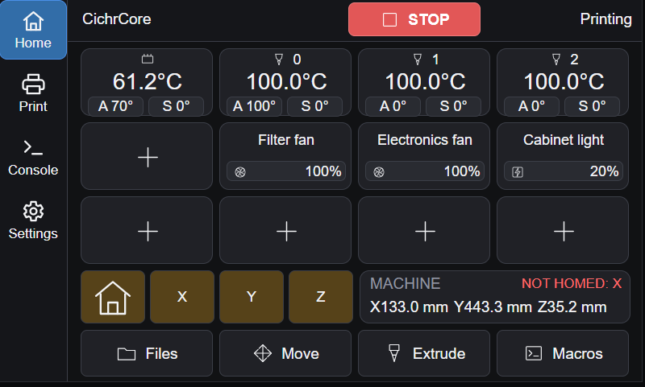
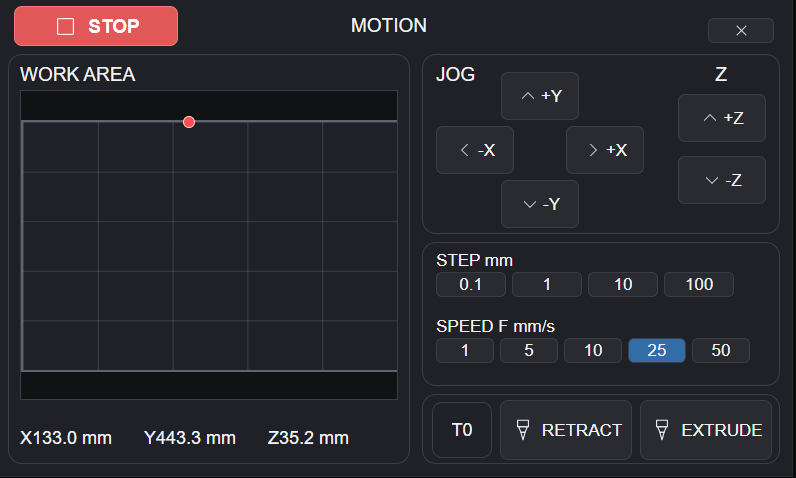

# PanelDue CICHR

A custom skin for PanelDue — same PanelDue + RepRapFirmware setup you already run, just a cleaner, more workshop-friendly UI on top of it.

Home page shows position, homing state and your quick-control tiles. Print page keeps temps, speed, extrusion factor, fans and outputs in one spot. Every value change pops up the same way: name, icon, current value, then `SET`.

## What it looks like



Home screen — status, heater temps, your configured fan and output tiles, and quick access to Files, Move, Extrude and Macros.



Move screen — the panel on the left is a top-down view of the bed. Tap anywhere on it and the nozzle physically travels there, no jogging needed. The right side still has manual jog buttons, step size and speed presets for fine adjustments.


## Tested on

Actually flashed and running on a PanelDue v3, 5.0" (`v3-5.0`). The other targets build fine from the same source but haven't been tried on real hardware yet: `v2-4.3`, `v2-5.0`, `v2-7.0`, `v2-7.0c`, `v3-4.3`, `v3-7.0`, `v3-7.0c`, `5.0i`, `7.0i`. (PanelDue v1 isn't supported.)

## What's actually different from stock PanelDue

Mostly the look — grey / cyan / dark green colour schemes, tighter layout, the popup style for adjustments. The one real functional difference is naming: fans and outputs show up with the names you gave them in RepRapFirmware instead of generic labels like `F0` or `P7`.

Fan names come straight from `fans[].name`, no setup needed.
```gcode
M950 F1 C"FAN1"                     ;Set FAN1 as Fan output F1
M106 P1 C"Chamber Ventilation" S0   ;Set F1 speed 0, name Fan - Chamber Ventilation
```

For outputs, something set up like:

```gcode
M950 P7 C"exp.heater7"                  ;Set exp.heater7 as output 7
M42 P7 S0                               ;Set Out7 to 0
global Out7Name = "Chamber Light"    	;Name Out7 as Chamber Light for PanelDue
```

shows up on the panel labeled `Chamber Light` instead of just "Out7".

## Building

```bat
BUILD_ONE.bat v3-5.0
```

No target given defaults to `v3-5.0`. Or build every target at once:

```bat
BUILD_ALL.bat
```

Each target gets two files in `output\<target>\`:

```
PanelDue-CICHR-v1.0.0-v3-5.0.bin           ← flash this normally
PanelDue-CICHR-v1.0.0-v3-5.0-nologo.bin    ← no boot splash, for splash dev
```

More: [docs/BUILD.md](docs/BUILD.md) · [docs/FLASHING.md](docs/FLASHING.md)

## Changing the splash screen

Edit the PNG, keep it exactly 800×480 (5"/7") or 480×272 (4.3"), same filename, then run:

```bat
MAKE_SPLASH.bat
```

and rebuild. It shows for 5 seconds or until touched, then goes straight into the UI — no separate loading screen after it.

Files: `SplashScreens/SplashScreen-CICHR-800x480.png` and `...-480x272.png`
Guide: [docs/SPLASH_SCREEN.md](docs/SPLASH_SCREEN.md)

## Preview without hardware

```bat
UX_PREVIEW.bat
```

Opens a browser preview of the 800×480 layout, fed by `preview/preview-config.js`.

## Docs

- [Build](docs/BUILD.md)
- [Flashing](docs/FLASHING.md)
- [RepRapFirmware integration](docs/RRF_INTEGRATION.md)
- [Splash screen](docs/SPLASH_SCREEN.md)
- [UX preview](docs/UX_PREVIEW.md)
- [Architecture](docs/ARCHITECTURE.md)

## License

GPL v3, except `src/ASF` which keeps its original Microchip/Atmel license. See [LICENSE](LICENSE) and [NOTICE.txt](NOTICE.txt).
